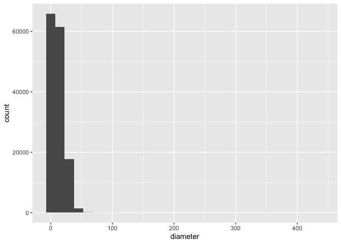
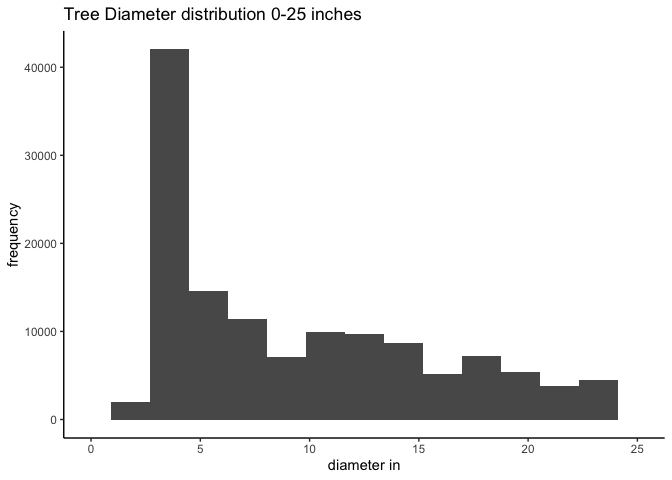
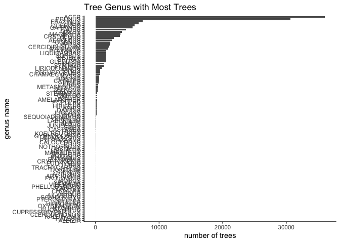
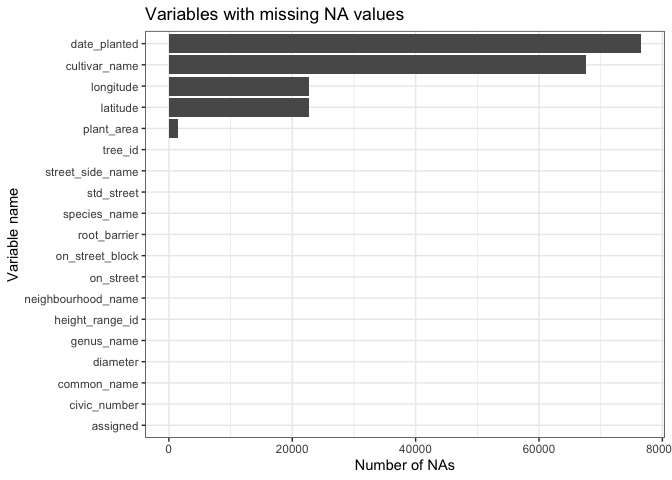
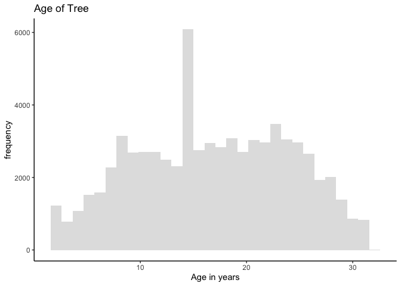
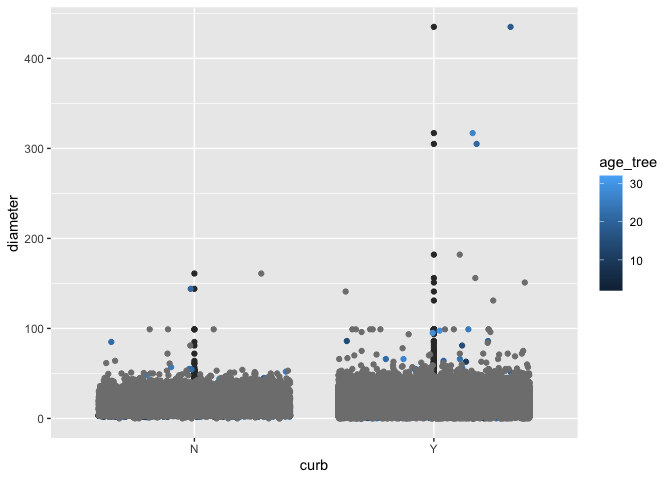

Mini Data-Analysis Deliverable 1 - Jessica Mukiri
================
Jessica Mukiri
06/10/2021

# Mini Data-Analysis Deliverable 1

This is my deliverable for the mini data analysis. My tasks are to:

1.  Choose favorite dataset (10 points)
2.  Explore chosen dataset (15 points)
3.  Write research questions (5 points)

Before starting on this task, I first need to download and load the
appropriate packages

``` r
# Packages needed
#install any of the loaded packages if not available e.g install.packages("devtools")
#devtools::install_github("UBC-MDS/datateachr")

library(datateachr)
library(tidyverse)
```

    ## ── Attaching packages ─────────────────────────────────────── tidyverse 1.3.1 ──

    ## ✓ ggplot2 3.3.5     ✓ purrr   0.3.4
    ## ✓ tibble  3.1.5     ✓ dplyr   1.0.7
    ## ✓ tidyr   1.1.4     ✓ stringr 1.4.0
    ## ✓ readr   2.0.2     ✓ forcats 0.5.1

    ## ── Conflicts ────────────────────────────────────────── tidyverse_conflicts() ──
    ## x dplyr::filter() masks stats::filter()
    ## x dplyr::lag()    masks stats::lag()

``` r
library(ggplot2)
library(lubridate)
```

    ## 
    ## Attaching package: 'lubridate'

    ## The following objects are masked from 'package:base':
    ## 
    ##     date, intersect, setdiff, union

# 1 Choosing favorite dataset

## 1.1 Selecting four data sets

The criteria for selecting the data sets:

1.  No human related data
2.  Include built environment (trees,rivers,buildings)
3.  Be in Canada, a city, with a preference for Vancouver BC, then the
    rest of Canada

Based on that criteria I was able to narrow my selection to the four
data sets below:

**1. vancouver\_trees**

**2. parking\_meters**

**3. apt\_buildings**

**4. flow\_sample**

## 1.2 Exploring the 4 data sets

In this next step I want to have a better sense of how many columns and
rows the data had and what kind of data is available.

``` r
#dplyr function glimpse was used 

glimpse(vancouver_trees)
```

    ## Rows: 146,611
    ## Columns: 20
    ## $ tree_id            <dbl> 149556, 149563, 149579, 149590, 149604, 149616, 149…
    ## $ civic_number       <dbl> 494, 450, 4994, 858, 5032, 585, 4909, 4925, 4969, 7…
    ## $ std_street         <chr> "W 58TH AV", "W 58TH AV", "WINDSOR ST", "E 39TH AV"…
    ## $ genus_name         <chr> "ULMUS", "ZELKOVA", "STYRAX", "FRAXINUS", "ACER", "…
    ## $ species_name       <chr> "AMERICANA", "SERRATA", "JAPONICA", "AMERICANA", "C…
    ## $ cultivar_name      <chr> "BRANDON", NA, NA, "AUTUMN APPLAUSE", NA, "CHANTICL…
    ## $ common_name        <chr> "BRANDON ELM", "JAPANESE ZELKOVA", "JAPANESE SNOWBE…
    ## $ assigned           <chr> "N", "N", "N", "Y", "N", "N", "N", "N", "N", "N", "…
    ## $ root_barrier       <chr> "N", "N", "N", "N", "N", "N", "N", "N", "N", "N", "…
    ## $ plant_area         <chr> "N", "N", "4", "4", "4", "B", "6", "6", "3", "3", "…
    ## $ on_street_block    <dbl> 400, 400, 4900, 800, 5000, 500, 4900, 4900, 4900, 7…
    ## $ on_street          <chr> "W 58TH AV", "W 58TH AV", "WINDSOR ST", "E 39TH AV"…
    ## $ neighbourhood_name <chr> "MARPOLE", "MARPOLE", "KENSINGTON-CEDAR COTTAGE", "…
    ## $ street_side_name   <chr> "EVEN", "EVEN", "EVEN", "EVEN", "EVEN", "ODD", "ODD…
    ## $ height_range_id    <dbl> 2, 4, 3, 4, 2, 2, 3, 3, 2, 2, 2, 5, 3, 2, 2, 2, 2, …
    ## $ diameter           <dbl> 10.00, 10.00, 4.00, 18.00, 9.00, 5.00, 15.00, 14.00…
    ## $ curb               <chr> "N", "N", "Y", "Y", "Y", "Y", "Y", "Y", "Y", "Y", "…
    ## $ date_planted       <date> 1999-01-13, 1996-05-31, 1993-11-22, 1996-04-29, 19…
    ## $ longitude          <dbl> -123.1161, -123.1147, -123.0846, -123.0870, -123.08…
    ## $ latitude           <dbl> 49.21776, 49.21776, 49.23938, 49.23469, 49.23894, 4…

``` r
# this data has 146,611 data rows,and 20 columns.the biggest data set I have chosen, interesting to see the very detailed data on spps name, location, diameter.(date, numeric and string data)
glimpse(flow_sample)
```

    ## Rows: 218
    ## Columns: 7
    ## $ station_id   <chr> "05BB001", "05BB001", "05BB001", "05BB001", "05BB001", "0…
    ## $ year         <dbl> 1909, 1910, 1911, 1912, 1913, 1914, 1915, 1916, 1917, 191…
    ## $ extreme_type <chr> "maximum", "maximum", "maximum", "maximum", "maximum", "m…
    ## $ month        <dbl> 7, 6, 6, 8, 6, 6, 6, 6, 6, 6, 6, 7, 6, 6, 6, 7, 5, 7, 6, …
    ## $ day          <dbl> 7, 12, 14, 25, 11, 18, 27, 20, 17, 15, 22, 3, 9, 5, 14, 5…
    ## $ flow         <dbl> 314, 230, 264, 174, 232, 214, 236, 309, 174, 345, 185, 24…
    ## $ sym          <chr> NA, NA, NA, NA, NA, NA, NA, NA, NA, NA, NA, NA, NA, NA, N…

``` r
#smallest of all the data sets chosen, only with 218 rows and 7 columns mostly (numeric and string)
glimpse(parking_meters)
```

    ## Rows: 10,032
    ## Columns: 22
    ## $ meter_head     <chr> "Twin", "Pay Station", "Twin", "Single", "Twin", "Twin"…
    ## $ r_mf_9a_6p     <chr> "$2.00", "$1.00", "$1.00", "$1.00", "$2.00", "$2.00", "…
    ## $ r_mf_6p_10     <chr> "$4.00", "$1.00", "$1.00", "$1.00", "$1.00", "$1.00", "…
    ## $ r_sa_9a_6p     <chr> "$2.00", "$1.00", "$1.00", "$1.00", "$2.00", "$2.00", "…
    ## $ r_sa_6p_10     <chr> "$4.00", "$1.00", "$1.00", "$1.00", "$1.00", "$1.00", "…
    ## $ r_su_9a_6p     <chr> "$2.00", "$1.00", "$1.00", "$1.00", "$2.00", "$2.00", "…
    ## $ r_su_6p_10     <chr> "$4.00", "$1.00", "$1.00", "$1.00", "$1.00", "$1.00", "…
    ## $ rate_misc      <chr> NA, "$ .50", NA, NA, NA, NA, NA, NA, NA, NA, NA, NA, NA…
    ## $ time_in_effect <chr> "METER IN EFFECT: 9:00 AM TO 10:00 PM", "METER IN EFFEC…
    ## $ t_mf_9a_6p     <chr> "2 Hr", "10 Hrs", "2 Hr", "2 Hr", "2 Hr", "3 Hr", "2 Hr…
    ## $ t_mf_6p_10     <chr> "4 Hr", "10 Hrs", "4 Hr", "4 Hr", "4 Hr", "4 Hr", "4 Hr…
    ## $ t_sa_9a_6p     <chr> "2 Hr", "10 Hrs", "2 Hr", "2 Hr", "2 Hr", "3 Hr", "2 Hr…
    ## $ t_sa_6p_10     <chr> "4 Hr", "10 Hrs", "4 Hr", "4 Hr", "4 Hr", "4 Hr", "4 Hr…
    ## $ t_su_9a_6p     <chr> "2 Hr", "10 Hrs", "2 Hr", "2 Hr", "2 Hr", "3 Hr", "2 Hr…
    ## $ t_su_6p_10     <chr> "4 Hr", "10 Hrs", "4 Hr", "4 Hr", "4 Hr", "4 Hr", "4 Hr…
    ## $ time_misc      <chr> NA, "No Time Limit", NA, NA, NA, NA, NA, NA, NA, NA, NA…
    ## $ credit_card    <chr> "No", "Yes", "No", "No", "No", "No", "No", "No", "No", …
    ## $ pay_phone      <chr> "66890", "59916", "57042", "57159", "51104", "60868", "…
    ## $ longitude      <dbl> -123.1289, -123.0982, -123.1013, -123.1862, -123.1278, …
    ## $ latitude       <dbl> 49.28690, 49.27215, 49.25468, 49.26341, 49.26354, 49.27…
    ## $ geo_local_area <chr> "West End", "Strathcona", "Riley Park", "West Point Gre…
    ## $ meter_id       <chr> "670805", "471405", "C80145", "D03704", "301023", "5913…

``` r
#10,032 rows and 22 columns, numeric and string data. Information on the location, payment method collected
glimpse(apt_buildings)
```

    ## Rows: 3,455
    ## Columns: 37
    ## $ id                               <dbl> 10359, 10360, 10361, 10362, 10363, 10…
    ## $ air_conditioning                 <chr> "NONE", "NONE", "NONE", "NONE", "NONE…
    ## $ amenities                        <chr> "Outdoor rec facilities", "Outdoor po…
    ## $ balconies                        <chr> "YES", "YES", "YES", "YES", "NO", "NO…
    ## $ barrier_free_accessibilty_entr   <chr> "YES", "NO", "NO", "YES", "NO", "NO",…
    ## $ bike_parking                     <chr> "0 indoor parking spots and 10 outdoo…
    ## $ exterior_fire_escape             <chr> "NO", "NO", "NO", "YES", "NO", NA, "N…
    ## $ fire_alarm                       <chr> "YES", "YES", "YES", "YES", "YES", "Y…
    ## $ garbage_chutes                   <chr> "YES", "YES", "NO", "NO", "NO", "NO",…
    ## $ heating_type                     <chr> "HOT WATER", "HOT WATER", "HOT WATER"…
    ## $ intercom                         <chr> "YES", "YES", "YES", "YES", "YES", "Y…
    ## $ laundry_room                     <chr> "YES", "YES", "YES", "YES", "YES", "Y…
    ## $ locker_or_storage_room           <chr> "NO", "YES", "YES", "YES", "NO", "YES…
    ## $ no_of_elevators                  <dbl> 3, 3, 0, 1, 0, 0, 0, 2, 4, 2, 0, 2, 2…
    ## $ parking_type                     <chr> "Underground Garage , Garage accessib…
    ## $ pets_allowed                     <chr> "YES", "YES", "YES", "YES", "YES", "Y…
    ## $ prop_management_company_name     <chr> NA, "SCHICKEDANZ BROS. PROPERTIES", N…
    ## $ property_type                    <chr> "PRIVATE", "PRIVATE", "PRIVATE", "PRI…
    ## $ rsn                              <dbl> 4154812, 4154815, 4155295, 4155309, 4…
    ## $ separate_gas_meters              <chr> "NO", "NO", "NO", "NO", "NO", "NO", "…
    ## $ separate_hydro_meters            <chr> "YES", "YES", "YES", "YES", "YES", "Y…
    ## $ separate_water_meters            <chr> "NO", "NO", "NO", "NO", "NO", "NO", "…
    ## $ site_address                     <chr> "65  FOREST MANOR RD", "70  CLIPPER R…
    ## $ sprinkler_system                 <chr> "YES", "YES", "NO", "YES", "NO", "NO"…
    ## $ visitor_parking                  <chr> "PAID", "FREE", "UNAVAILABLE", "UNAVA…
    ## $ ward                             <chr> "17", "17", "03", "03", "02", "02", "…
    ## $ window_type                      <chr> "DOUBLE PANE", "DOUBLE PANE", "DOUBLE…
    ## $ year_built                       <dbl> 1967, 1970, 1927, 1959, 1943, 1952, 1…
    ## $ year_registered                  <dbl> 2017, 2017, 2017, 2017, 2017, NA, 201…
    ## $ no_of_storeys                    <dbl> 17, 14, 4, 5, 4, 4, 4, 7, 32, 4, 4, 7…
    ## $ emergency_power                  <chr> "NO", "YES", "NO", "NO", "NO", "NO", …
    ## $ `non-smoking_building`           <chr> "YES", "NO", "YES", "YES", "YES", "NO…
    ## $ no_of_units                      <dbl> 218, 206, 34, 42, 25, 34, 14, 105, 57…
    ## $ no_of_accessible_parking_spaces  <dbl> 8, 10, 20, 42, 12, 0, 5, 1, 1, 6, 12,…
    ## $ facilities_available             <chr> "Recycling bins", "Green Bin / Organi…
    ## $ cooling_room                     <chr> "NO", "NO", "NO", "NO", "NO", "NO", "…
    ## $ no_barrier_free_accessible_units <dbl> 2, 0, 0, 42, 0, NA, 14, 0, 0, 1, 25, …

``` r
#3455 rows, 37 columns, numeric and string data information on type of building, year built present 
```

## 1.3 Selecting two data sets.

Based on my initial criteria and having a look at the data I have
narrowed my choices to:

**1.vancouver\_trees**

**2.parking\_meters**

As a new comer to Vancouver analyzing this data, will give me a better
understanding on Vancouver, where trees and parking meters are located
and what access I have them, which neighborhoods.

``` r
#seeing the different neighborhoods that trees and parking meters are located 
loc_tree <- vancouver_trees %>% 
              group_by(neighbourhood_name)  %>% 
              tally()  
loc_tree
```

    ## # A tibble: 22 × 2
    ##    neighbourhood_name           n
    ##    <chr>                    <int>
    ##  1 ARBUTUS-RIDGE             5169
    ##  2 DOWNTOWN                  5159
    ##  3 DUNBAR-SOUTHLANDS         9415
    ##  4 FAIRVIEW                  4002
    ##  5 GRANDVIEW-WOODLAND        6703
    ##  6 HASTINGS-SUNRISE         10547
    ##  7 KENSINGTON-CEDAR COTTAGE 11042
    ##  8 KERRISDALE                6936
    ##  9 KILLARNEY                 6148
    ## 10 KITSILANO                 8115
    ## # … with 12 more rows

``` r
loc_parkingm <- parking_meters  %>% 
              group_by(geo_local_area)  %>% 
              tally()  
loc_parkingm
```

    ## # A tibble: 18 × 2
    ##    geo_local_area               n
    ##    <chr>                    <int>
    ##  1 Arbutus-Ridge              148
    ##  2 Downtown                  3771
    ##  3 Fairview                  1624
    ##  4 Grandview-Woodland         312
    ##  5 Hastings-Sunrise             7
    ##  6 Kensington-Cedar Cottage    50
    ##  7 Kerrisdale                 139
    ##  8 Killarney                   32
    ##  9 Kitsilano                  920
    ## 10 Mount Pleasant             898
    ## 11 Renfrew-Collingwood         43
    ## 12 Riley Park                 280
    ## 13 Shaughnessy                 15
    ## 14 South Cambie                91
    ## 15 Strathcona                 508
    ## 16 Sunset                      77
    ## 17 West End                   940
    ## 18 West Point Grey            177

## 1.4 Selecting one data set

**1.vancouver\_trees**

info on
[vancouver\_trees](https://opendata.vancouver.ca/explore/dataset/street-trees/information/?disjunctive.species_name&disjunctive.common_name&disjunctive.height_range_id)

Vancouver is a very green city and during my first month here I have
seen a lot of trees. As an environmentalist it will be interesting to
explore a number of questions such as what species of trees are
planted,in which neighborhoods, how old the trees are, which years were
trees planted and are there certain years more trees were planted?

# 2 Exploring vancouver\_trees data set

In this process I have delve into the data and have better understanding
of what is available.

## 2.1a Plotting the distribution of tree diameter

This distribution will give me a sense of how wide the trees are in
Vancouver.

``` r
# first I rename the Vancouver_trees data set to make it easier when running analysis 
van_trees <- vancouver_trees

#plotting a histogram
hist_vant <- ggplot(van_trees, aes(x=diameter)) +
  geom_histogram(bins = 30)

hist_vant
```

<!-- -->

``` r
# the histogram has many extremes, I want to understand my data a bit better to understand the diameter range

van_diam_summary <- summary(van_trees$diameter)

van_diam_summary
```

    ##    Min. 1st Qu.  Median    Mean 3rd Qu.    Max. 
    ##    0.00    3.50    9.00   11.49   16.50  435.00

``` r
# the range is 0 -435 the mean is 11.49 and the 3rd quarter is  16.50, to visualize this, I will set my x lim to 25 to visualize the histogram again

# doing this will removes a number of rows (13438) that do no fit the criteria but gives a better visualization of diameter of 90% of the trees in the city (13438/146611 * 100)

hist_vant1 <- ggplot(van_trees, aes(x=diameter)) +
  geom_histogram(bins = 15) +
  xlim(0, 25)+
  labs(title="Tree Diameter distribution 0-25 inches") +
          ylab("frequency") +
          xlab ("diameter in")+
          theme_classic()


hist_vant1
```

    ## Warning: Removed 13438 rows containing non-finite values (stat_bin).

    ## Warning: Removed 2 rows containing missing values (geom_bar).

<!-- -->

## 2.1b No of tree’s per Genus

Here I want to know what which species genus is the most popular in
Vancouver? The relationship is between genus name and tree id.

I first need to create a new data set with two variables.Counting the
number of trees for each genus and then visualize with a bar plot

``` r
notree_spps <- van_trees %>% 
          group_by(genus_name) %>%  #group data by genus name
          tally() %>%  #count total by genus group
          arrange(desc(n))  %>%  #rearrange data to see a clearer trend
          ggplot(aes(x= reorder(genus_name,n), y = n)) +  #plot bar graph and ensure you reorder the reuslts
          geom_bar(stat = "identity")+
          coord_flip() +  #makes it easier to visualize the data 
          labs(title="Tree Genus with Most Trees") +
          ylab("number of trees") +
          xlab ("genus name") +
          theme_classic()


notree_spps
```

<!-- -->

``` r
#make sure to open graph in full screen for clarity
```

Understanding the genus is key in identifying the appropriate selecting
and monitoring trees. This exercise allows me to think about, is there a
reason the ACER genus is mostly planted, is the tree native to
Vancouver, is there more of a likely hood for survival? The data set
does not have these answers but I am now curious to find out why?

## 2.1c Columns with missing na’s

``` r
van_tree_na <- van_trees %>% 
                  summarise(across(everything(), 
                   ~sum(is.na(.)))) %>%  #using acroos and everying and the summarize function to extract info needed
  pivot_longer(cols = contains("e"), names_to = "variable",     values_to = "count")%>%  #transpose  data so it easier to plot with 
  ggplot( aes(reorder(variable,count),count)) + #bar graph are a good way to visualize this data
  geom_bar(stat = "identity")+
  labs(title="Variables with missing NA values") +
  ylab("Number of NAs") +
  xlab ("Variable name") +
  coord_flip() +
  theme_bw()

van_tree_na
```

<!-- -->

``` r
#to be able to select all the columns is used guidance from 
#https://www.rebeccabarter.com/blog/2020-07-09-across/
```

It is key for me to clean my data and see which key variables are
missing for carrying out analysis. For instance if we don’t know where
the trees a planted (lat, long) or the date is was planted it becomes
tricky to carry out specific analysis.

## 2.1d Current Age of tree.

This new variable will help me know how old the. the oldest tree is
planted. Given the date the analysis is being carried out.

``` r
# created a new variable called age_tree using lubridate
age_tree <- van_trees %>% 
             mutate(age_tree =trunc(van_trees$date_planted %--%  (Sys.Date()) / years(1))) %>%  #lubridate for calculating age and trunc for rounding off see link at end of chunk
      arrange(desc(age_tree)) # arranged age from olderst to youngest tree 

age_tree
```

    ## # A tibble: 146,611 × 21
    ##    tree_id civic_number std_street   genus_name species_name cultivar_name
    ##      <dbl>        <dbl> <chr>        <chr>      <chr>        <chr>        
    ##  1  122127          412 E 46TH AV    TILIA      CORDATA      <NA>         
    ##  2  122130          434 E 46TH AV    TILIA      CORDATA      <NA>         
    ##  3   31395         2105 W 32ND AV    TILIA      CORDATA      <NA>         
    ##  4   31396         2105 W 32ND AV    TILIA      CORDATA      <NA>         
    ##  5   34719         3408 W 36TH AV    TILIA      EUCHLORA   X <NA>         
    ##  6   59867         5715 BERKELEY ST  PRUNUS     SERRULATA    KWANZAN      
    ##  7   62833         1203 BROUGHTON ST ACER       RUBRUM       RED SUNSET   
    ##  8   68625         7520 COLUMBIA ST  ACER       RUBRUM       <NA>         
    ##  9   68629         7580 COLUMBIA ST  ACER       RUBRUM       <NA>         
    ## 10   68630         7620 COLUMBIA ST  ACER       RUBRUM       <NA>         
    ## # … with 146,601 more rows, and 15 more variables: common_name <chr>,
    ## #   assigned <chr>, root_barrier <chr>, plant_area <chr>,
    ## #   on_street_block <dbl>, on_street <chr>, neighbourhood_name <chr>,
    ## #   street_side_name <chr>, height_range_id <dbl>, diameter <dbl>, curb <chr>,
    ## #   date_planted <date>, longitude <dbl>, latitude <dbl>, age_tree <dbl>

``` r
summary(age_tree$age_tree) #to assess the max min and range of age of trees
```

    ##    Min. 1st Qu.  Median    Mean 3rd Qu.    Max.    NA's 
    ##    2.00   11.00   17.00   16.84   23.00   32.00   76548

``` r
#plot a distrutbtion to visualize the data
hist_age <- ggplot(age_tree, aes(x=age_tree)) +
  geom_histogram(alpha = 0.2) +
  labs(title="Age of Tree") +
          ylab("frequency") +
          xlab ("Age in years")+
          theme_classic()

hist_age
```

    ## `stat_bin()` using `bins = 30`. Pick better value with `binwidth`.

    ## Warning: Removed 76548 rows containing non-finite values (stat_bin).

<!-- -->

``` r
# I used code from here to help with lubridate.
#https://datacornering.com/how-to-calculate-age-in-r/
```

I can see from the data that there a years where more tress are planted
and others where less are planted. The age variable will allow me to
further explore if there are any relationships between age and genus
planted or and neighborhood planted, when carrying out further analysis.

## 2.1e Which genus has tree older than 10 years and diameter greater than 10

I did this as a bons question to test the use of filter, in this simple
example I used a simple criteria to select which trees are older than 10
and have a diameter of ten

``` r
tree_ten <- age_tree %>% 
            group_by(genus_name) %>% 
            filter(age_tree >= 10, diameter >=10)
tree_ten
```

    ## # A tibble: 9,771 × 21
    ## # Groups:   genus_name [63]
    ##    tree_id civic_number std_street  genus_name species_name cultivar_name
    ##      <dbl>        <dbl> <chr>       <chr>      <chr>        <chr>        
    ##  1  122127          412 E 46TH AV   TILIA      CORDATA      <NA>         
    ##  2  122130          434 E 46TH AV   TILIA      CORDATA      <NA>         
    ##  3   31395         2105 W 32ND AV   TILIA      CORDATA      <NA>         
    ##  4   31396         2105 W 32ND AV   TILIA      CORDATA      <NA>         
    ##  5   34719         3408 W 36TH AV   TILIA      EUCHLORA   X <NA>         
    ##  6   59867         5715 BERKELEY ST PRUNUS     SERRULATA    KWANZAN      
    ##  7   68625         7520 COLUMBIA ST ACER       RUBRUM       <NA>         
    ##  8   68629         7580 COLUMBIA ST ACER       RUBRUM       <NA>         
    ##  9   68630         7620 COLUMBIA ST ACER       RUBRUM       <NA>         
    ## 10   68631         7620 COLUMBIA ST ACER       RUBRUM       <NA>         
    ## # … with 9,761 more rows, and 15 more variables: common_name <chr>,
    ## #   assigned <chr>, root_barrier <chr>, plant_area <chr>,
    ## #   on_street_block <dbl>, on_street <chr>, neighbourhood_name <chr>,
    ## #   street_side_name <chr>, height_range_id <dbl>, diameter <dbl>, curb <chr>,
    ## #   date_planted <date>, longitude <dbl>, latitude <dbl>, age_tree <dbl>

## 2.1f Boxplot

This again was additional as I was testing using boxplots

``` r
#using geom_boxplox and geom_jitter to see the relationship between dimater and if the tree is planted on a curb.

boxp_1 <- ggplot(age_tree, aes(x=curb, y = diameter, color = age_tree)) +
  geom_boxplot()+
  geom_jitter()

boxp_1
```

<!-- --> From
the data shown, trees planted by the curb have a higher diamter.

# 3 Research questions?

1.  Is there any relationship between genus, tree diameter and height?

2.  Which neighborhood has the most trees, and what genus and species
    are found in these neighborhoods?

3.  Which year where most trees planted and where (curb,plant
    area,block)?

4.  Are the oldest trees planted, dependent on a neighborhood,. Has the
    distribution of genus and spps changed over the last 30 years?

# Comments and questions to TA’s

-   I was having difficulty with re-sizing labels for such a big data
    set, would it make sense not to use this kind of graph?

-   I also attempted additional questions just so that I can learn how
    to carry out such tasks
