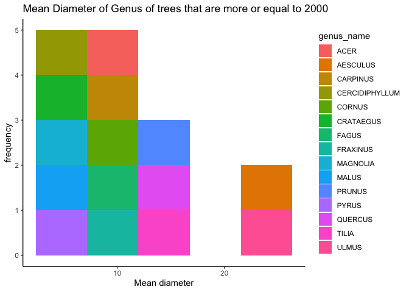
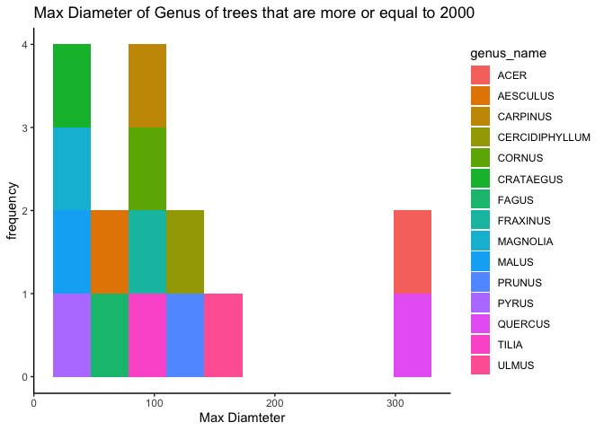
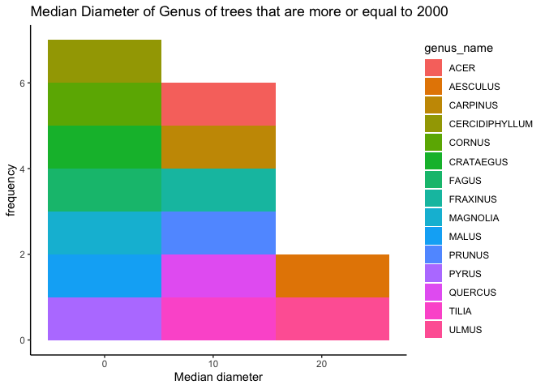
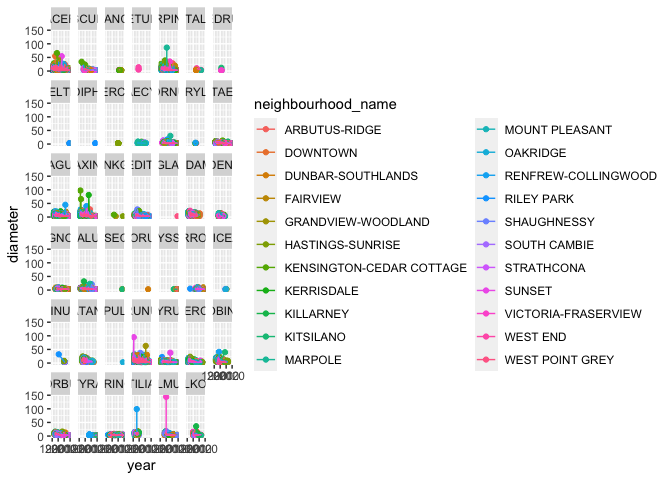
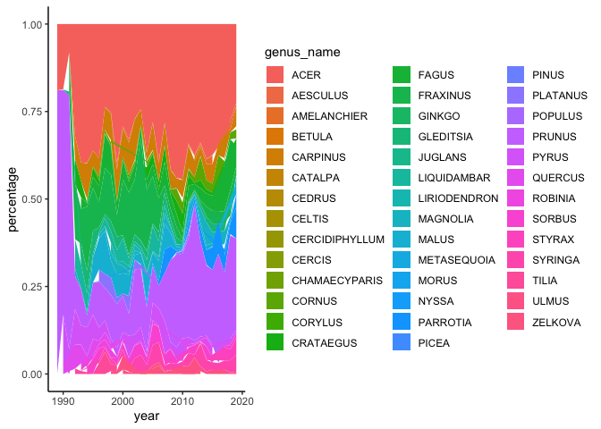
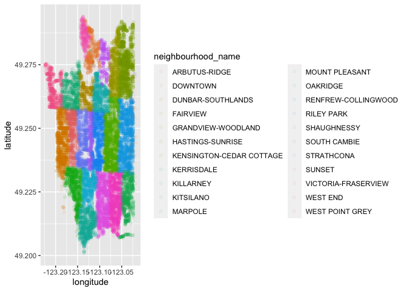

Mini Data-Analysis Deliverable 2 - Jessica Mukiri
================
Jessica Mukiri
19/10/2021

# Mini Data-Analysis Deliverable 2

This is my deliverable for the mini data analysis. My tasks are to:

1.  Process and summarize your data (15 points)
2.  Tidy your data (12.5 points)

Before starting on this task, I first need to download and load the
appropriate packages

``` r
# Packages needed
#install any of the loaded packages if not available e.g install.packages("devtools")
#devtools::install_github("UBC-MDS/datateachr")

suppressPackageStartupMessages(library(datateachr))
suppressPackageStartupMessages(library(tidyverse))
suppressPackageStartupMessages(library(ggplot2))
suppressPackageStartupMessages(library(lubridate))
```

# 1 Process and summarize of vancouver trees data

## 1.1 Research Questions

1.  Is there any relationship between genus, tree diameter and height?

2.  Which neighborhood has the most trees, and what genus and species
    are found in these neighborhoods?

3.  Which year where most trees planted and where (curb,plant
    area,block)?

4.  Are the oldest trees planted, dependent on a neighborhood,. Has the
    distribution of genus and spps changed over the last 30 years?

## 1.2 Summaries and Graphs

*Question 1.Is there any relationship between genus, tree diameter and
height?*

For this first question am computing he *range*, *mean*, and *median* &
\*standard deviation" of **diameter** across the groups the **genus
group** from vancouver trees data.

``` r
# first I rename the Vancouver_trees data set to make it easier when running analysis 
van_trees <- vancouver_trees

#select the appropriate variables for this question

q1_sum <- van_trees %>% 
          select(genus_name,height_range_id,diameter) %>% 
          group_by(genus_name) %>% 
          summarise(mean = mean(diameter), n= n(), max = max(diameter), min = min(diameter), median = median(diameter), sd = sd(diameter))

q1_sum
```

    ## # A tibble: 97 × 7
    ##    genus_name   mean     n   max   min median    sd
    ##    <chr>       <dbl> <int> <dbl> <dbl>  <dbl> <dbl>
    ##  1 ABIES       12.9    190  42.5     1  12     9.71
    ##  2 ACER        10.6  36062 317       0   8     8.76
    ##  3 AESCULUS    23.7   2570  64       0  25     9.57
    ##  4 AILANTHUS   15.9      4  21.5     3  19.5   8.64
    ##  5 ALBIZIA      6        1   6       6   6    NA   
    ##  6 ALNUS       17.5     74  40       0  17.5   8.94
    ##  7 AMELANCHIER  3.21   226  20       0   3     1.79
    ##  8 ARALIA       6.81     4  12       3   6.12  3.92
    ##  9 ARAUCARIA   11.4     10  32       3   8.5   9.92
    ## 10 ARBUTUS     18.4     10  33       6  17.5  10.7 
    ## # … with 87 more rows

Three histograms based out of summarized diameter means, with each
histogram having different sized bins was used to answer question 1
above.

``` r
#this is a big data set,to ensure the graphs are visible I made sure the only genus with more than 2000 trees were visible

# I dropped na's in the data, I also used the filter dplyr function and geom_histogram

q1_graph <- q1_sum %>% 
            drop_na() %>% 
            filter( n >= 2000) %>% 
          ggplot(aes(x= mean , fill = genus_name))+
          geom_histogram(bins = 5)+
          labs(title="Mean Diameter of Genus of trees that are more or equal to 2000") +
          ylab("frequency") +
          xlab ("Mean diameter")+
          theme_classic()

q1_graph
```

<!-- -->

``` r
q2_graph <- q1_sum %>% 
            drop_na() %>% 
            filter( n >= 2000) %>% 
          ggplot(aes(x= max, fill = genus_name ))+
          geom_histogram(bins = 10)+
          labs(title="Max Diameter of Genus of trees that are more or equal to 2000") +
          ylab("frequency") +
          xlab ("Max Diamteter")+
          theme_classic()

q2_graph
```

<!-- -->

``` r
q3_graph <- q1_sum %>% 
            drop_na() %>% 
            filter( n >= 2000) %>% 
          ggplot(aes(x= median, fill= genus_name))+
          geom_histogram(bins = 3) +
          labs(title="Median Diameter of Genus of trees that are more or equal to 2000") +
          ylab("frequency") +
          xlab ("Median diameter")+
          theme_classic()

q3_graph
```

<!-- --> The
histogram with the title *Mean Diameter of Genus of trees that are more
or equal to 2000* is the best as t histogram as it give a good overview
of the mean diameter and the bins make the most sense in understanding
the distribution.

*2.Which neighborhood has the most trees, and what genus and species are
found in these neighborhoods?*

For this question I computed he number of observations for at least one
of how many trees of each genus are in specific neighborhoods

``` r
q2_sum <- van_trees %>% 
          group_by(genus_name,neighbourhood_name) %>% 
          summarise(n= n()) %>% 
          arrange(desc(n))
```

    ## `summarise()` has grouped output by 'genus_name'. You can override using the `.groups` argument.

``` r
q2_sum
```

    ## # A tibble: 1,303 × 3
    ## # Groups:   genus_name [97]
    ##    genus_name neighbourhood_name           n
    ##    <chr>      <chr>                    <int>
    ##  1 PRUNUS     DUNBAR-SOUTHLANDS         2554
    ##  2 ACER       HASTINGS-SUNRISE          2508
    ##  3 ACER       DUNBAR-SOUTHLANDS         2464
    ##  4 PRUNUS     RENFREW-COLLINGWOOD       2443
    ##  5 ACER       KENSINGTON-CEDAR COTTAGE  2438
    ##  6 ACER       RENFREW-COLLINGWOOD       2395
    ##  7 PRUNUS     VICTORIA-FRASERVIEW       2330
    ##  8 ACER       KITSILANO                 2211
    ##  9 PRUNUS     SUNSET                    2163
    ## 10 ACER       DOWNTOWN                  2043
    ## # … with 1,293 more rows

Here I created a graph out of summarized variables that has at least two
geom layers. I experimented with geom\_point and geom\_line .This graph
does not answer the question however,allowed me to play around with the
facet\_wrap function

**question to the TA, how do I ensure that the legend does not over-ride
the graph**

``` r
q6_graph <-van_trees %>% 
            drop_na() %>% 
             separate(col = date_planted, into = c("year","month","day"),sep="-")%>% 
             mutate(year = as.numeric(year)) %>% 
              ggplot(aes(x= year, y= diameter, color = neighbourhood_name))+
              geom_point() + 
              geom_line() +
              facet_wrap(~ genus_name)


q6_graph
```

    ## geom_path: Each group consists of only one observation. Do you need to adjust
    ## the group aesthetic?
    ## geom_path: Each group consists of only one observation. Do you need to adjust
    ## the group aesthetic?
    ## geom_path: Each group consists of only one observation. Do you need to adjust
    ## the group aesthetic?
    ## geom_path: Each group consists of only one observation. Do you need to adjust
    ## the group aesthetic?

<!-- -->

*3.Which year where most trees planted and where (curb,plant
area,block)?*

The summary allows me to understand which year how many trees were
planted and if this was on a curb or not.

``` r
#Based on two categorical variables, calculate two summary statistics of your choosing
q3_sum <- van_trees %>% 
          group_by(genus_name,on_street_block,curb,date_planted) %>%
          drop_na() %>% 
          separate(col = date_planted, into = c("year","month","day"),sep="-")%>% 
          mutate(year = as.numeric(year)) %>% 
          group_by(year,curb) %>% 
          summarise(n= n(), max = max(n))
```

    ## `summarise()` has grouped output by 'year'. You can override using the `.groups` argument.

``` r
q3_sum
```

    ## # A tibble: 61 × 4
    ## # Groups:   year [31]
    ##     year curb      n   max
    ##    <dbl> <chr> <int> <int>
    ##  1  1989 Y       185   185
    ##  2  1990 N        24    24
    ##  3  1990 Y       441   441
    ##  4  1991 N        19    19
    ##  5  1991 Y       276   276
    ##  6  1992 N        19    19
    ##  7  1992 Y       892   892
    ##  8  1993 N         4     4
    ##  9  1993 Y      1055  1055
    ## 10  1994 N         9     9
    ## # … with 51 more rows

I created a geom\_area map and changed the alpa transparency so it is
more visible. This graph shows a good overview of the genus of species
grown over the years.The alpha transpercy ensure we can see overlaps

``` r
q4_graph <- van_trees %>% 
            drop_na() %>% 
             separate(col = date_planted, into = c("year","month","day"),sep="-") %>% 
             mutate(year = as.numeric(year),
                    genus_name = as.factor(genus_name)) %>% 
           arrange(desc(year)) %>% # arranged age from oldest to youngest tree 
          group_by(year,genus_name) %>% 
          summarise(n = n()) %>% 
          mutate( percentage = n/sum(n)) %>% 
           ggplot(aes(x= year, y= percentage, fill = genus_name))+
          geom_area(aplha = 0.01, size = 1) +
           theme_classic()
```

    ## `summarise()` has grouped output by 'year'. You can override using the `.groups` argument.

    ## Warning: Ignoring unknown parameters: aplha

``` r
q4_graph
```

<!-- -->

*4.Are the oldest trees planted, dependent on a neighborhood,. Has the
distribution of genus and spps changed over the last 30 years?*

Here I created a categorical variable called age\_tree with four groups
from a numerical variable I created

``` r
q4_sum <- van_trees %>% 
             mutate(age_tree =trunc(van_trees$date_planted %--%  (Sys.Date()) / years(1))) %>%  
  #lubridate for calculating age and trunc for rounding off see link at end of chunk
           arrange(desc(age_tree)) %>% # arranged age from oldest to youngest tree 
           mutate(age_tree = case_when( age_tree < 10 ~ "young",
                                 age_tree < 20 ~ "middle age",
                                 age_tree < 30 ~ "old",
                                  TRUE ~ "very old"))%>% 
          group_by(age_tree) %>% 
          summarise(n = n()) %>% 
          arrange(desc(n))

q4_sum
```

    ## # A tibble: 4 × 2
    ##   age_tree       n
    ##   <chr>      <int>
    ## 1 very old   78237
    ## 2 middle age 27852
    ## 3 old        26120
    ## 4 young      14402

I can see most of the trees are older than 30 showing that tree planting
exercises have somewhat reduced

Here I created graph of your choosing, make one of the axes logarithmic,
and format the axes labels so that they are “pretty” or easier to read.

Again **question to the TA, how do I ensure that the legend does not
over-ride the graph**. Also was not sure where else to use the
logarthimic axes based on my questions.

``` r
q7_graph <- van_trees %>% 
            drop_na() %>% 
           ggplot(aes(x=longitude, y= latitude ,color = neighbourhood_name ))+
           geom_point(alpha = 0.05)+ 
          scale_y_log10() 


q7_graph
```

<!-- -->

## 1.3

For this questions, doing the summaries brought me closer to answering
the question, I had laid out. The graphs not so much as as the data I am
working with does not have numeric variables to be calculated making the
graphing questions together with my questions difficult to
graph.However, I did see some interesting results on the graphs and
looking forward to answer these is milestone 3.

Moving forward I would focus more on question two and four are
interesting and showing some interesting results

# 2 Tidy data vancouver trees data

### 2.1 Van\_trees Tidy Data

The van\_trees data set is tidy as each column is it’s own variable,
each row as an individual observation and each cell has only one value.
Fitting the criteria for tidy data

### 2.2 Untidying\_Van\_trees

Making the vantress data untidy, here I am changing the data into a
wider format.

``` r
untidy_data <- van_trees %>% 
            drop_na() %>% 
            pivot_wider(names_from = species_name, values_from = diameter, values_fill = 0)

untidy_data
```

    ## # A tibble: 41,859 × 107
    ##    tree_id civic_number std_street genus_name cultivar_name common_name assigned
    ##      <dbl>        <dbl> <chr>      <chr>      <chr>         <chr>       <chr>   
    ##  1  149556          494 W 58TH AV  ULMUS      BRANDON       BRANDON ELM N       
    ##  2  149590          858 E 39TH AV  FRAXINUS   AUTUMN APPLA… AUTUMN APP… Y       
    ##  3  149617         4909 SHERBROOK… ACER       COLUMNARE     COLUMNAR N… N       
    ##  4  149618         4925 SHERBROOK… ACER       COLUMNARE     COLUMNAR N… N       
    ##  5  149619         4969 SHERBROOK… ACER       COLUMNARE     COLUMNAR N… N       
    ##  6  149625          720 E 39TH AV  FRAXINUS   AUTUMN APPLA… AUTUMN APP… N       
    ##  7  149640         6968 SELKIRK ST ACER       COLUMNARE     COLUMNAR N… N       
    ##  8  149673         5241 WINDSOR ST FRAXINUS   RAYWOOD       RAYWOOD ASH N       
    ##  9  149683         7011 SELKIRK ST ACER       COLUMNARE     COLUMNAR N… N       
    ## 10  149684         1223 W 54TH AV  ACER       COLUMNARE     COLUMNAR N… N       
    ## # … with 41,849 more rows, and 100 more variables: root_barrier <chr>,
    ## #   plant_area <chr>, on_street_block <dbl>, on_street <chr>,
    ## #   neighbourhood_name <chr>, street_side_name <chr>, height_range_id <dbl>,
    ## #   curb <chr>, date_planted <date>, longitude <dbl>, latitude <dbl>,
    ## #   AMERICANA <dbl>, PLATANOIDES <dbl>, OXYCARPA <dbl>, CERASIFERA <dbl>,
    ## #   CALLERYANA <dbl>, FREEMANI   X <dbl>, RUBRUM <dbl>, PENNSYLVANICA <dbl>,
    ## #   X YEDOENSIS <dbl>, TRIACANTHOS <dbl>, SERRULATA <dbl>, CRUS-GALLI <dbl>, …

Each species is now its own individual column with its diameter.

In this next section I transform the data from untidy to tidy using the
pivot longer function.Where the species is now associated witha genus
and the diameter is also it’s own column

``` r
tidy_data <- untidy_data %>% 
            pivot_longer(col = 19:107,names_to = "species_name", values_to =  "diameter")
  
tidy_data  
```

    ## # A tibble: 3,725,451 × 20
    ##    tree_id civic_number std_street genus_name cultivar_name common_name assigned
    ##      <dbl>        <dbl> <chr>      <chr>      <chr>         <chr>       <chr>   
    ##  1  149556          494 W 58TH AV  ULMUS      BRANDON       BRANDON ELM N       
    ##  2  149556          494 W 58TH AV  ULMUS      BRANDON       BRANDON ELM N       
    ##  3  149556          494 W 58TH AV  ULMUS      BRANDON       BRANDON ELM N       
    ##  4  149556          494 W 58TH AV  ULMUS      BRANDON       BRANDON ELM N       
    ##  5  149556          494 W 58TH AV  ULMUS      BRANDON       BRANDON ELM N       
    ##  6  149556          494 W 58TH AV  ULMUS      BRANDON       BRANDON ELM N       
    ##  7  149556          494 W 58TH AV  ULMUS      BRANDON       BRANDON ELM N       
    ##  8  149556          494 W 58TH AV  ULMUS      BRANDON       BRANDON ELM N       
    ##  9  149556          494 W 58TH AV  ULMUS      BRANDON       BRANDON ELM N       
    ## 10  149556          494 W 58TH AV  ULMUS      BRANDON       BRANDON ELM N       
    ## # … with 3,725,441 more rows, and 13 more variables: root_barrier <chr>,
    ## #   plant_area <chr>, on_street_block <dbl>, on_street <chr>,
    ## #   neighbourhood_name <chr>, street_side_name <chr>, height_range_id <dbl>,
    ## #   curb <chr>, date_planted <date>, longitude <dbl>, latitude <dbl>,
    ## #   species_name <chr>, diameter <dbl>

### 2.3 Picking Question

*2. Which neighborhood has the most trees, and what genus and species
are found in these neighborhoods?*

*4. Are the oldest trees planted, dependent on a neighborhood,. Has the
distribution of genus and spps changed over the last 30 years?*

I choose these two questions as they are very interesting and will also
allow me to explore some geom layers such as geom\_map together with
making summaries. For this last assignment the tibble I will use can be
seen below

``` r
#cleaning data, separating , creating  and selecting only columns I will use)
mda3_t <- van_trees %>% 
                drop_na() %>% 
                separate(col = date_planted, into = c("year","month","day"),sep="-")%>% 
                mutate(year = as.numeric(year))%>%   select(tree_id,genus_name,species_name,longitude,latitude,neighbourhood_name,year)
mda3_t 
```

    ## # A tibble: 41,859 × 7
    ##    tree_id genus_name species_name longitude latitude neighbourhood_name    year
    ##      <dbl> <chr>      <chr>            <dbl>    <dbl> <chr>                <dbl>
    ##  1  149556 ULMUS      AMERICANA        -123.     49.2 MARPOLE               1999
    ##  2  149590 FRAXINUS   AMERICANA        -123.     49.2 KENSINGTON-CEDAR CO…  1996
    ##  3  149617 ACER       PLATANOIDES      -123.     49.2 KENSINGTON-CEDAR CO…  1993
    ##  4  149618 ACER       PLATANOIDES      -123.     49.2 KENSINGTON-CEDAR CO…  1993
    ##  5  149619 ACER       PLATANOIDES      -123.     49.2 KENSINGTON-CEDAR CO…  1993
    ##  6  149625 FRAXINUS   AMERICANA        -123.     49.2 KENSINGTON-CEDAR CO…  1993
    ##  7  149640 ACER       PLATANOIDES      -123.     49.2 OAKRIDGE              1993
    ##  8  149673 FRAXINUS   OXYCARPA         -123.     49.2 KENSINGTON-CEDAR CO…  1993
    ##  9  149683 ACER       PLATANOIDES      -123.     49.2 OAKRIDGE              1993
    ## 10  149684 ACER       PLATANOIDES      -123.     49.2 OAKRIDGE              1993
    ## # … with 41,849 more rows
